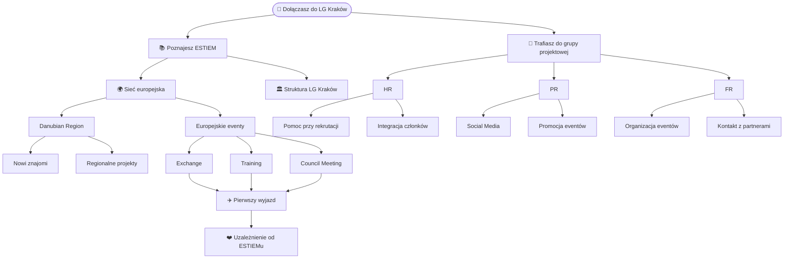

_Czyli Twoja lista kontrolna od pomysłu do podsumowania_ 🗂️

---

## O co chodzi?

Krótka lista kontrolna do odhaczania na każdym etapie organizacji eventu. Używaj razem z SOPem [Jak nie ogłupieć organizując coś?](/eventy/jak-nie-oglupiesc).

<Info>
  👤 **Dla kogo:** Project Leader organizujący event **Kiedy tego potrzebujesz:** od razu jak zaczniesz organizację
</Info>

---

## 🗓️ Przed eventem

### Na starcie

- Wymyślona agenda
- Wstępny budżet gotowy w Organisation Master Sheet
- Event zaakceptowany przez Local Responsible
- Ekipa pomocnicza zebrana i grupka na Messengerze założona
- Budżet sprawdzony i poprawiony przez VP Finance & Logistics
- VP Corporate Relations poinformowany — szuka współprac
- VP HR poinformowany — motywuje członków do pomocy

### Logistyka

- Nocleg zarezerwowany
- Transport ogarnięty (uwaga: bez biletów ulgowych dla zagranicy!)
- Sale na AGH zarezerwowane jeśli potrzebne ([wocy@agh.edu.pl](mailto:wocy@agh.edu.pl))
- Aktywności zaplanowane i potwierdzone
- International Night — sala wynajęta

### Rekrutacja uczestników

- Daily Tasks rozpisane w arkuszu
- Rekrutacja uczestników otwarta
- Event wypromowany na Instagramie
- Promocja wysłana na grupkach ESTIEM
- Event obstawiony minimum w 90% ✅

### Tydzień przed

- Wszyscy uczestnicy potwierdzeni
- Plan awaryjny na wypadek odwołań
- Briefing ekipy pomocniczej zrobiony
- Wszystkie prezki gotowe (G2K, ESTIEM Session, Language & Culture)

---

## 🎯 W trakcie eventu

- Briefing ekipy przed startem
- G2K Session ✅
- ESTIEM Session ✅
- Language & Culture Session ✅
- Aktywności zgodnie z agendą ✅
- International Night ✅
- Feedback Session na koniec ✅

---

## 📋 Po evencie

- Raport poeventowy wypełniony i wysłany
- Budżet końcowy rozliczony z VP Finance & Logistics
- Zdjęcia wrzucone i przekazane VP PR
- Podsumowanie na Instagramie opublikowane
- Master Sheet zaktualizowany i zapisany na Drive
- Ekipa pomocnicza podziękowana 💛

---

## 😅 Czego się nauczyliśmy

<Warning>
  Z doświadczenia LG Kraków: checklist działa tylko jeśli jej używasz na bieżąco, nie na dwa dni przed eventem. Wróć do niej co tydzień.
</Warning>

---

## 📎 Przydatne zasoby

<CardGroup cols={2}>
  <Card title="Jak nie ogłupieć organizując?" icon="book" href="/jak-nie-oglupiec-organizujac-cos">
    Pełny SOP organizacji eventu
  </Card>

  <Card title="Organisation Master Sheet" icon="file-spreadsheet" href="#">
    Template do budżetu i agendy
  </Card>

  <Card title="Daily Tasks" icon="list-check" href="#">
    Arkusz do rozpisania zadań
  </Card>

  <Card title="Local Responsible" icon="person" href="/rola1">
    Kontakt do LR w razie pytań
  </Card>
</CardGroup>

---

<Note>
  📅 Ostatnia aktualizacja: 28.05.2026 | ✍️ Autor: Amelia
</Note>